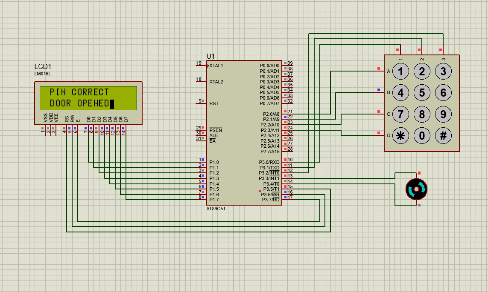
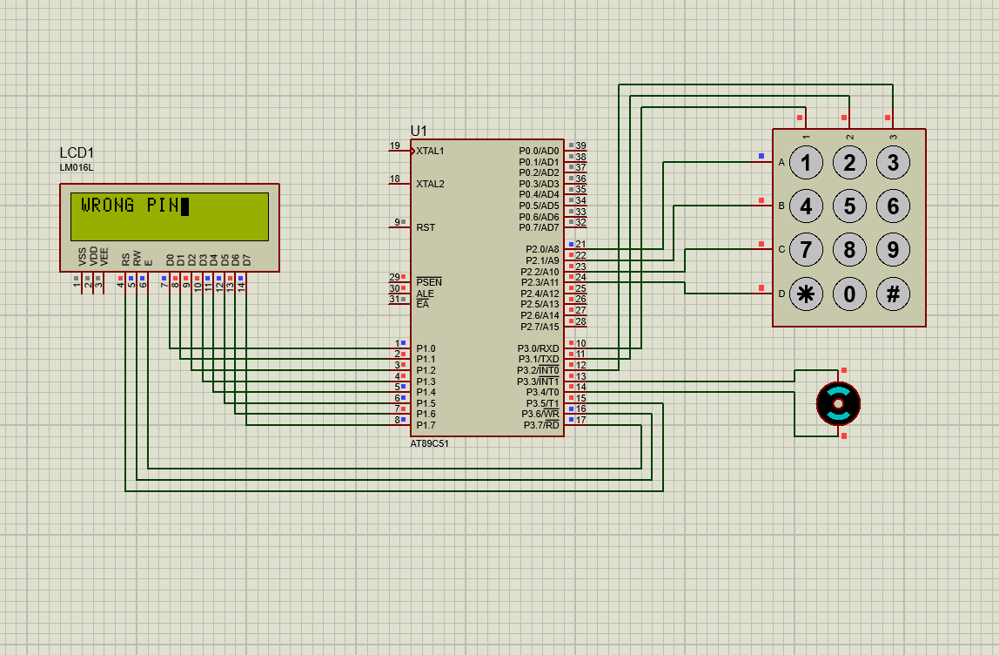

# Programming in 8051 microcontroller

- Perform basic operations
- Find the sum of set of numbers
- Perform block transfer with a set of numbers
- Find the largest from a set of numbers
- Find the smallest from a set of numbers
- Sort a set of numbers in ascending/descending order
- Perform a linear search

# PROJECT SIMULATION

### START

 

### WHILE ENTERING CORRECT PASSSWORD

 

### WHILE ENTERING WRONG PASSWORD

